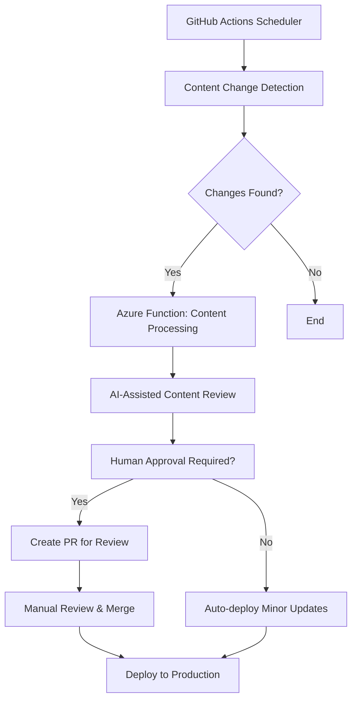

# Auto-Update Approaches for Language Documentation

## Executive Summary

The BestBot server (formerly BestPracticesMcp) currently serves static markdown files containing best practices for various programming languages. As languages evolve, these best practices need periodic updates to remain current and authoritative. This document analyzes different approaches for automating the update process while maintaining quality, consistency, and reliability.

## Current Architecture Analysis

### Content Structure
- **16 supported languages** with dedicated markdown files
- **Authoritative sources** referenced in each file (e.g., Python PEPs, Oracle Java docs, OWASP guidelines)
- **Process-wide file caching** with 5-minute TTL and file modification detection
- **Azure Functions-based** MCP server with individual tools per language

### Update Frequency Requirements
- **Language specifications**: Quarterly to annually (major versions, LTS releases)
- **Security guidelines**: Monthly to quarterly (vulnerability discoveries, new attack patterns)
- **Framework updates**: Monthly to bi-annually (framework-specific best practices)
- **Tooling changes**: Quarterly (new linters, formatters, testing frameworks)

## Approach 1: Timer-Triggered Azure Function

### Implementation
```csharp
[Function("UpdateLanguagePractices")]
public async Task UpdateLanguagePractices([TimerTrigger("0 0 2 * * MON")] TimerInfo timer)
{
    // Weekly Monday 2 AM execution
    foreach (var language in SupportedLanguages)
    {
        await UpdateLanguageContent(language);
    }
}
```

### Pros
✅ **Native Azure integration** - leverages existing infrastructure  
✅ **Cost-effective** - only runs when scheduled, minimal compute costs  
✅ **Simple deployment** - single function added to existing codebase  
✅ **Centralized logging** - integrates with Application Insights  
✅ **Built-in retry logic** - Azure Functions handles transient failures  
✅ **Easy monitoring** - function execution metrics available in portal  

### Cons
❌ **Execution time limits** - 10-minute timeout for Consumption plan  
❌ **Memory constraints** - limited to 1.5GB RAM for content processing  
❌ **Cold start issues** - weekly execution may hit cold start penalties  
❌ **Single point of failure** - entire update process stops if function fails  
❌ **Limited external API access** - may hit rate limits for documentation sources  
❌ **Manual intervention required** - no automatic rollback for bad updates  

### Best Suited For
- **Small to medium content volumes** (current 16 languages)
- **Predictable update schedules** (weekly/monthly batches)
- **Organizations prioritizing cost control**

## Approach 2: Autonomous Agent (GitHub Actions + AI)

### Implementation
```yaml
name: Content Update Agent
on:
  schedule:
    - cron: '0 6 * * 1'  # Weekly Monday 6 AM
  workflow_dispatch:     # Manual trigger

jobs:
  update-content:
    runs-on: ubuntu-latest
    steps:
      - uses: actions/checkout@v4
      - name: Update Language Content
        uses: ./.github/actions/ai-content-updater
        with:
          languages: 'python,java,csharp'
          approval-required: true
```

### Pros
✅ **Intelligent content analysis** - AI can understand context and relevance  
✅ **Source code integration** - direct commits with change tracking  
✅ **Human approval workflow** - PR-based review before deployment  
✅ **Parallel processing** - concurrent updates for multiple languages  
✅ **Rich change detection** - semantic diff analysis, not just file timestamps  
✅ **Cost-effective at scale** - GitHub Actions minutes vs. Azure compute  
✅ **Community contribution** - external contributors can enhance agent logic  

### Cons
❌ **AI reliability concerns** - potential for hallucinated or biased content  
❌ **Complex setup** - requires AI integration, prompt engineering, validation logic  
❌ **Dependency on external AI services** - OpenAI/Azure OpenAI rate limits and costs  
❌ **Version control complexity** - automated commits may clutter git history  
❌ **Quality assurance overhead** - requires robust human review process  
❌ **Security considerations** - AI agent needs repository write access  

### Best Suited For
- **High-volume content management** (50+ languages/frameworks)
- **Organizations with strong AI/ML capabilities**
- **Teams with robust content review processes**

## Approach 3: External Process (Azure Logic Apps + Power Automate)

### Implementation
```json
{
  "definition": {
    "triggers": {
      "Recurrence": {
        "recurrence": {
          "frequency": "Week",
          "interval": 1,
          "schedule": {
            "hours": [3],
            "minutes": [0],
            "weekDays": ["Monday"]
          }
        }
      }
    },
    "actions": {
      "ForEach_Language": {
        "type": "Foreach",
        "items": "@variables('SupportedLanguages')",
        "actions": {
          "Check_Source_Updates": "...",
          "Update_Content": "...",
          "Validate_Changes": "...",
          "Deploy_Updates": "..."
        }
      }
    }
  }
}
```

### Pros
✅ **Enterprise workflow capabilities** - built-in approval, notification, error handling  
✅ **Visual workflow design** - low-code approach, accessible to non-developers  
✅ **Rich connector ecosystem** - 400+ connectors for external services  
✅ **Robust error handling** - automatic retries, alerting, dead letter queues  
✅ **Compliance features** - audit logs, data loss prevention, governance  
✅ **Scalable execution** - handles high-volume, long-running processes  
✅ **Integration flexibility** - easy connection to SharePoint, Teams, Outlook  

### Cons
❌ **Higher costs** - Logic Apps pricing for complex workflows can be significant  
❌ **Learning curve** - requires understanding of Logic Apps concepts and limitations  
❌ **Limited programming flexibility** - constrained by connector capabilities  
❌ **Vendor lock-in** - tightly coupled to Microsoft ecosystem  
❌ **Debugging complexity** - workflow troubleshooting can be challenging  
❌ **Performance limitations** - slower execution compared to native code  

### Best Suited For
- **Enterprise environments** with existing Logic Apps infrastructure
- **Organizations requiring compliance and audit trails**
- **Teams preferring low-code solutions**

## Approach 4: Hybrid Recommendation

### Architecture


### Implementation Strategy
1. **GitHub Actions**: Scheduled monitoring and change detection
2. **Azure Functions**: Heavy content processing and API interactions
3. **AI Integration**: Content analysis and automated minor updates
4. **Human Oversight**: Critical changes require manual review

### Benefits
✅ **Cost optimization** - GitHub Actions for scheduling, Azure Functions for processing  
✅ **Scalability** - each component can scale independently  
✅ **Quality assurance** - automated detection + human oversight  
✅ **Flexibility** - can adapt to different update cadences per language  
✅ **Reliability** - multiple failure points can be isolated and recovered  

## Implementation Recommendations

### Phase 1: Timer-Triggered Function (Immediate)
- **Timeline**: 2-3 weeks
- **Scope**: Single Azure Function with basic update logic
- **Risk**: Low
- **Benefit**: Immediate automation for high-priority languages (Python, JavaScript, C#)

### Phase 2: Enhanced Detection (Short-term)
- **Timeline**: 1-2 months
- **Scope**: Add intelligent change detection, source monitoring
- **Risk**: Medium
- **Benefit**: More targeted updates, reduced noise

### Phase 3: AI-Assisted Updates (Medium-term)
- **Timeline**: 3-6 months
- **Scope**: Integrate AI for content analysis and automated minor updates
- **Risk**: High
- **Benefit**: Significant reduction in manual effort

### Phase 4: Full Hybrid System (Long-term)
- **Timeline**: 6-12 months
- **Scope**: Complete workflow with multiple update strategies
- **Risk**: High
- **Benefit**: Scalable, enterprise-ready content management

## Quality Assurance Framework

### Content Validation Pipeline
1. **Source verification** - Validate URLs and content accessibility
2. **Semantic analysis** - Detect breaking changes vs. minor updates
3. **Cross-reference checking** - Ensure consistency across related languages
4. **Security review** - Flag potential security-related changes
5. **Testing integration** - Validate updated content doesn't break MCP tools

### Rollback Strategy
- **Versioned content** - Git-based versioning with tagged releases
- **Canary deployments** - Test updates with subset of users
- **Automated rollback** - Revert on error threshold breach
- **Manual override** - Emergency rollback capabilities

## Success Metrics

### Operational Metrics
- **Update frequency**: % of languages updated within target timeframe
- **Content freshness**: Average age of content vs. source material
- **Automation rate**: % of updates requiring no human intervention
- **Error rate**: Failed updates per month

### Quality Metrics
- **User satisfaction**: Feedback on content accuracy and relevance
- **Content accuracy**: Manual audit scores for automated updates
- **Change detection precision**: False positive rate for update triggers
- **Review efficiency**: Time from content change to deployment

## Conclusion

**Recommended Starting Point**: Timer-Triggered Azure Function (Approach 1)

This provides immediate value with minimal risk and complexity. The implementation can be enhanced iteratively, eventually evolving into a hybrid system that combines the best aspects of all approaches.

**Long-term Vision**: Hybrid system with intelligent automation for minor updates and human oversight for significant changes, ensuring both efficiency and quality in the content management process.